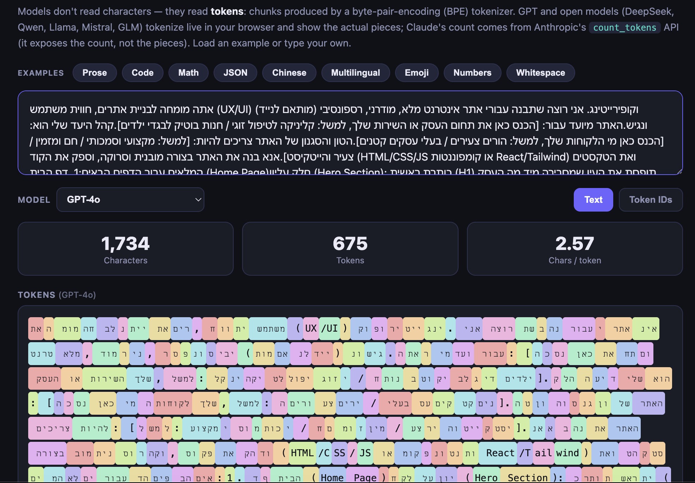
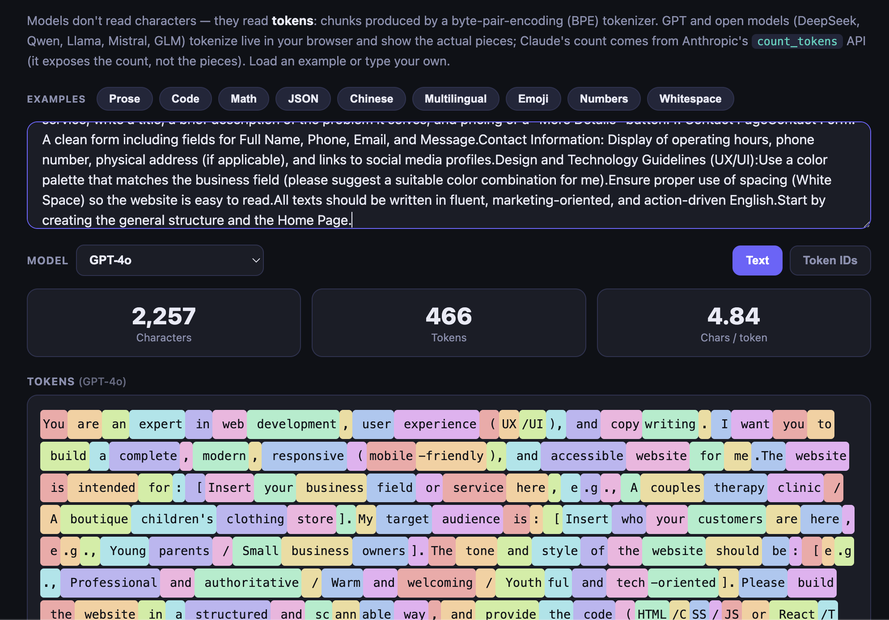

# Agent Workshop

A hands-on FastAPI application that walks through the building blocks of AI agents — from stateless LLM calls to full agentic loops — step by step.

## Features

| Module | What it demonstrates |
|---|---|
| **Stateless LLM** | Single, context-free call to the model (Anthropic or OpenAI) |
| **Memory** | Full conversation history passed on every request, with Claude compaction on supporting models |
| **Tools** | Model-driven tool use (calculator, datetime) — works on both providers |
| **Web Search** | Live grounding via Claude's built-in `web_search` server tool |
| **RAG** | Retrieve → Augment → Generate with in-memory employee data |
| **Agent Mode** | Compose Tools + Web Search + RAG into a single agentic loop |
| **Planning** | Zero-shot, few-shot, chain-of-thought, decomposition, ReAct |
| **Agent in Action** | Multi-step stock analysis agent (Plan → Execute → Synthesise → Verify), with live progress and risk-tolerance tuning |
| **Frameworks** | Overview + interactive decision guide comparing agent frameworks (LangGraph, Pydantic AI, LlamaIndex, and more) |
| **Tokenizer** | Interactive tokenizer playground — see how prose, code, JSON, multilingual (including RTL/Hebrew) and emoji text gets split into tokens across GPT, open models (DeepSeek, Qwen, Llama, Mistral, GLM) and Claude |

### Workshop UX

- **Provider & model switcher** — pick Anthropic or OpenAI models per-request from a grouped dropdown; the choice threads through every endpoint (`/chat`, `/plan`, `/agent`).
- **Missing API key warning** — a `⚠️ No API key` badge appears next to the model picker whenever the selected provider's key isn't set in `.env`; calling it anyway returns a clear, friendly error instead of a raw SDK exception.
- **Cost & latency badges** — every call shows its estimated USD cost (from per-model pricing) and round-trip latency.
- **Peek under the hood** — a collapsible panel showing the exact system/messages/tools payload sent to the model, including any injected RAG or web-search context.
- **Context window meter** — a live sidebar gauge of how much of the context window the current conversation is using.
- **Export / Clear conversation** — download the full chat transcript as Markdown at any point, or wipe the conversation and start fresh. Export keeps the whole session's history even if you toggle Memory mid-conversation.
- **"What is an Agent?" / Control Loop pages** — standalone interactive explainers for agent concepts, separate from the live chat demos.
- **Reasoning effort selector** — for models that support it, choose the effort/reasoning level per-request; it's threaded through every LLM call (stateless, memory, tools, agent, planning).

## Screenshots

**Tokenizer playground — right-to-left (Hebrew) prompt:**



**Tokenizer playground — English prompt:**



## Quick Start

### 1. Clone the repo

```bash
git clone https://github.com/YOUR_USERNAME/agent_workshop.git
cd agent_workshop
```

### 2. Configure your API key(s)

```bash
cp .env.example .env
# Edit .env and add your Anthropic and/or OpenAI API key(s)
```

You only need to set the key for the provider(s) you plan to use — the model
picker in the UI shows a **⚠️ No API key** warning next to any provider whose
key isn't configured, and picking a model from that provider returns a clear
error instead of a confusing one.

The `.env` file is listed in `.gitignore` and is **never** committed to the repository.

### 3. Start the server

```bash
./start.sh
```

The script will:
- Create a Python virtual environment (`.venv`) if one does not exist
- Install all dependencies from `requirements.txt`
- Start the FastAPI server at `http://127.0.0.1:8000`
- Open the UI in your browser automatically

#### Share mode (ngrok)

To give participants a public URL:

```bash
./start.sh --share
```

Requires [ngrok](https://ngrok.com) to be installed and authenticated.

## Environment Variables

| Variable | Default | Description |
|---|---|---|
| `ANTHROPIC_API_KEY` | *(optional)* | Your Anthropic API key — required to use Claude models |
| `ANTHROPIC_MODEL` | `claude-sonnet-5` | Default model used when no model is selected |
| `OPENAI_API_KEY` | *(optional)* | Your OpenAI API key — required to use GPT models |

## Choosing a Provider

Every module's model picker groups models by provider (**Anthropic** / **OpenAI**).
Switch providers at any time from the dropdown — the backend automatically
routes the request (including tool calls, memory, and structured JSON output)
to the right SDK. Anthropic-only features (context-management/compaction
betas, the built-in `web_search` server tool) transparently fall back to a
plain call when an OpenAI model is selected.

Check `GET /config` to see the model catalog and which providers currently
have a configured API key.

## Sensitive Data Notice

- **API keys** are loaded exclusively from the `.env` file, which is gitignored. No secrets are ever committed to the repository.
- The employee records in `rag.py` are **entirely fictional** demo data invented for the RAG workshop module. They do not represent real people.
